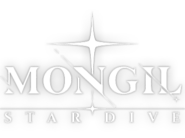

# ⭐ Stardive Launcher

<div align="center">
  
  <br/>
  <strong>Native Linux Launcher & Downloader for <em>Mongil: Star Dive</em></strong>
  <p>A lightweight, beautiful, and high-performance native launcher built with Rust and Tauri 2, bypassing the official Netmarble Electron launcher and Wine compatibility hurdles.</p>

  <p>
    <a href="https://github.com/Shidohs/stardive-launcher/actions"></a>
    <a href="https://www.rust-lang.org/"></a>
    <a href="https://v2.tauri.app/"></a>
    <a href="LICENSE"></a>
    
  </p>
</div>

---

## 📖 Overview

The official PC launcher for **Mongil: Star Dive** relies on an Electron container and proprietary Netmarble services that frequently fail under Wine and Proton (Chromium sandbox exceptions, CrashSight VEH assertion crashes, broken PowerShell installers, and DPI scaling defects).

**Stardive Launcher** is a standalone, open-source replacement written in **Rust** and powered by **Tauri 2 (WebKit2GTK 4.1)**. It provides a commercial-grade, glassmorphic desktop interface inspired by **Wavey Launcher** (Wuthering Waves) and **HoyoPlay** (Genshin / Honkai: Star Rail), adhering to **Material Design 3 (M3)** design tokens.

---

## ✨ Features

- **🚀 Ultra Lightweight & Native**:
  - Pure Rust async backend with `tokio` and `reqwest`.
  - Tauri 2 frontend with hardware-accelerated CSS glassmorphism (`backdrop-filter: blur(28px)`), radial glowing elevations, Inter typography, and pure SVG vectors (zero emojis).
  - Standalone compiled binary of only **~17 MB** with negligible memory footprint (~120 MB RAM vs Electron's >600 MB).

- **🌐 Direct Netmarble CDN Integration**:
  - Communicates directly with Netmarble's official builds API (`apis.netmarble.com`).
  - Chunked, resumable multi-stream downloader supporting `Range: bytes=` headers.
  - Automatic MD5 checksum verification on downloaded packages.
  - Native ZIP extractor generating standard `game_manifest.json` metadata.

- **🍷 Seamless Linux Gaming Stack**:
  - Out-of-the-box runner auto-detection (**GE-Proton**, Proton Experimental, Vanilla Wine, Lutris).
  - Built-in wrappers: `gamemoderun`, `mangohud`, and `gamescope`.
  - Performance optimization flags: `DXVK_ASYNC=1`, `WINEESYNC=1`, `WINEFSYNC=1`, `PROTON_ENABLE_NVAPI=1` (DLSS support).
  - Dedicated **WineD3D safety switch** (`PROTON_USE_WINED3D=0`) preventing accidental fallbacks to slow OpenGL pipelines.

- **⚡ Unreal Engine 5 FPS Unlocker**:
  - Automatically patches `Engine.ini` and `GameUserSettings.ini` in the prefix to unlock framerates beyond Netmarble's default 60 FPS cap (60, 120, 144, 240, or Unlimited).

- **🎁 Gacha QoL Utilities**:
  - One-click launcher navigation for **Coupon Redemption** (`couponweb.netmarble.com`) and the official **Web Store**.
  - Shader cache cleaner (DXVK / VKD3D) to resolve stutter after game updates.
  - Integrated execution log inspector (`launcher_game.log`).

- **💻 Dual-Mode Architecture (GUI & CLI)**:
  - Run the full interactive Tauri desktop application or invoke headless commands directly in scripts or Steam launch options.

---

## 🛠️ Requirements

- **Linux Distribution**: Any modern 64-bit Linux distro (Arch, Fedora, Ubuntu, Debian, openSUSE, etc.).
- **Proton / Wine Runner**: [GE-Proton](https://github.com/GloriousEggroll/proton-ge-custom) (recommended: `GE-Proton11-6` or newer) installed in `~/.local/share/Steam/compatibilitytools.d/`.
- **System Libraries**:
  - `webkit2gtk-4.1` (or `webkit2gtk-4.0`)
  - `gtk3`
  - `libappindicator-gtk3` (optional, for system tray)

---

## 📦 Building from Source

### 1. Install Dependencies

**Arch Linux / Manjaro:**
```bash
sudo pacman -S --needed base-devel rustup webkit2gtk-4.1 openssl
rustup default stable
```

**Fedora:**
```bash
sudo dnf install @development-tools rust cargo webkit2gtk4.1-devel openssl-devel
```

**Ubuntu / Debian:**
```bash
sudo apt update
sudo apt install build-essential curl libwebkit2gtk-4.1-dev libssl-dev libgtk-3-dev
curl --proto '=https' --tlsv1.2 -sSf https://sh.rustup.rs | sh
```

### 2. Clone and Build

```bash
git clone https://github.com/Shidohs/stardive-launcher.git
cd stardive-launcher

# Build optimized release binary
cargo build --release
```

The compiled binary will be located at:
`target/release/stardive-launcher`

---

## 🚀 Usage

### Desktop GUI Mode

Simply launch the binary or start it from your application launcher:
```bash
./target/release/stardive-launcher
```

### Headless CLI Commands

Stardive Launcher can also be operated directly from the terminal or invoked by external frontends (such as Steam, Lutris, or Heroic):

```bash
# Query local installation status and Netmarble CDN server version
./stardive-launcher --status

# Launch the game directly through GE-Proton (bypassing the GUI)
./stardive-launcher --play

# Check for updates and download if available
./stardive-launcher --update

# Force download & extraction of the latest official client
./stardive-launcher --download

# Update Lutris game configuration with correct prefix and executable
./stardive-launcher --update-lutris
```

---

## ⚙️ Configuration

Configuration is automatically stored in standard XDG paths:
`~/.config/stardive-launcher/config.json`

Example configuration:
```json
{
  "game_dir": "/home/user/Games/mongil-star-dive/drive_c/Program Files/Netmarble/Netmarble Game/STARDIVE",
  "prefix_dir": "/home/user/Games/mongil-star-dive",
  "proton_path": "/home/user/.local/share/Steam/compatibilitytools.d/GE-Proton11-6-x86_64",
  "executable": "STARDIVE.exe",
  "launch_args": "NMENV=nmp",
  "dxvk_async": true,
  "wine_esync": true,
  "wine_fsync": true,
  "nvapi": true,
  "proton_use_wined3d": false,
  "use_gamemode": true,
  "use_mangohud": false,
  "use_gamescope": false,
  "fps_limit": 144,
  "vsync": false,
  "custom_env": {}
}
```

---

## 📜 Disclaimer

**Stardive Launcher** is a third-party, open-source utility developed independently by fans for Linux compatibility. It is **not** affiliated with, endorsed by, or associated with **Netmarble Corporation** or the **Mongil: Star Dive** development team. All trademarks, logos, and game assets belong to their respective owners.

---

## 📄 License

This project is licensed under the [MIT License](LICENSE).
